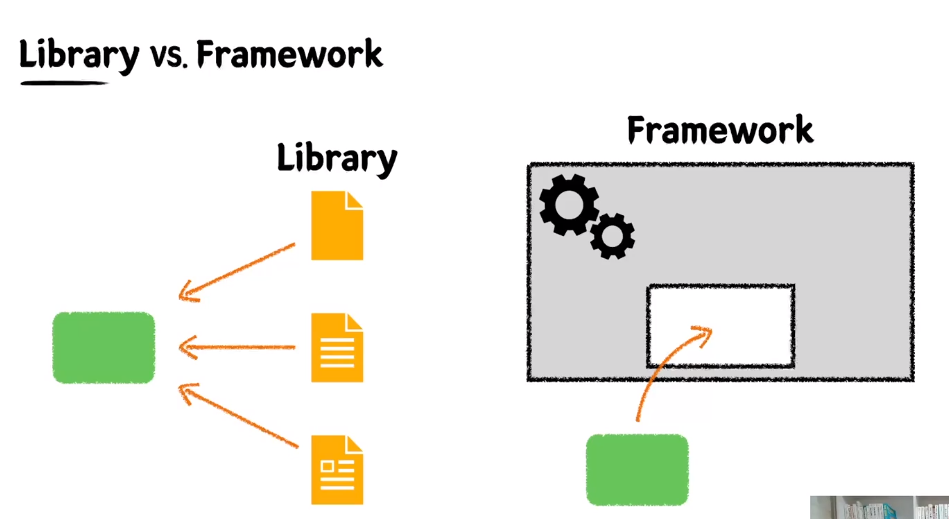
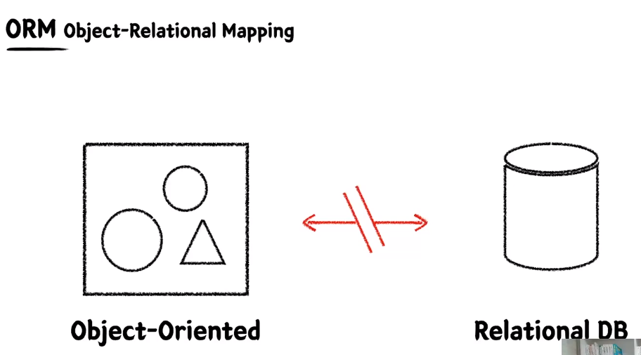

### Library VS Framework

- 라이브러리 - 내 코드(초록색박스)가 주체가 됨
- 프레임워크 - 내 코드가 수동적임

### Spring

- IOC(Inversion of Control) - 객체의 생명주기를 제3자(IoC컨테이너)가 관리해줌
- DI(Dependency Injection) - 컨테이너가 주입해준 객체를 사용한다.
- AOP(Aspect Oriented Programming) - 로깅 등 공통적으로 사용되는 기능을 분리하여 관리
    - 참조 블로그 : https://programforlife.tistory.com/107#google_vignette

### ORM

- 객체 지향 패러다임과 관계형 DB 패러다임의 불일치
- ORM을 사용함으로써 개발자는 비즈니스 로직에 집중할 수 있다.

### JPA
- Java진영의 ORM기술 표준
- 인터페이스, 보통 JPA의 구현체들 중 Hibernate를 사용한다.
- 반복적인 CRUD SQL을 생성 및 실행
- Spring진영에서는 JPA를 한번 더 추상화한 Spring Data JPA제공