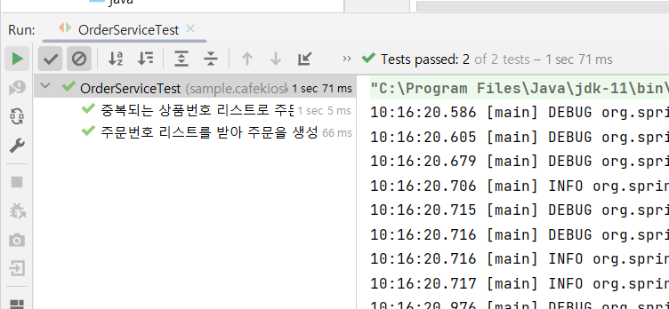
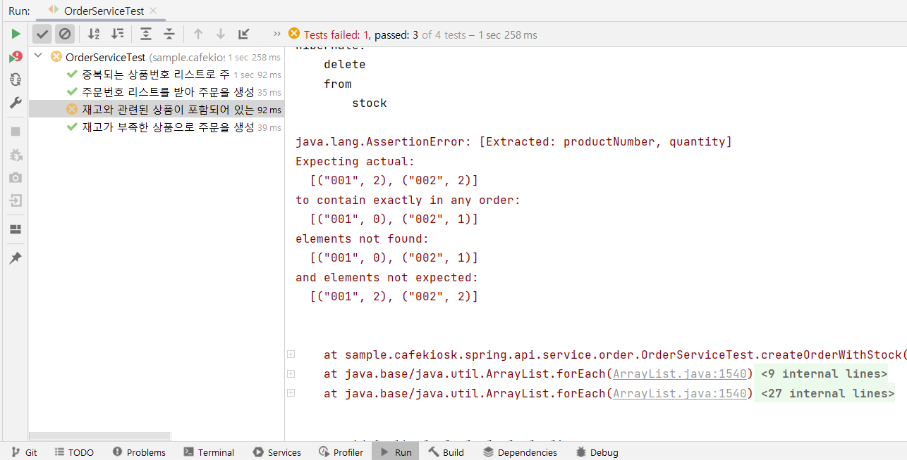

## @SpringBootTest와 @DataJpaTest의 차이?

- @SpringBootTest
  - 모든 레이어를 포함한 전체에플리케이션을 통합적으로 테스트하고자 할때 사용
  - `@Transactional`이 반영되어있지 않음
- @DataJpaTest
  - JPA기반의 데이터 계층을 테스트하는데 사용됨
  - **`@Transactional`이 반영되어있음**
  - 즉, **자동 Rollback이 가능하기때문에 테스트코드에서 tearDown()에 삭제메소드를 작성할 필요가 없다.**

## 그렇다면, @SpringBootTest를 작성한 테스트코드에 @Transactional까지 걸어주면 되는거 아냐?
- OrderServiceTest를 예로 들었을때, @Transactional과 @SpringBootTest를 함께 작성하면 테스트가 통과됨을 알 수 있었다.

- but, 주문차감 기능을 생성하였을때, OrderServiceTest에 @Transactional을 걸어준다고 하더라도, update기능이 동작하지 않아, 주문이 차감되는 부분이 제대로 동작하지 않음을 알 수 있었다.

- 위 에러를 해결하려면, OrderServiceTest가 아닌 OrderService에 @Transactional을 걸어줘야한다.
- 즉, @Transactional의 경계를 잘 파악하고 써야한다는 것!

- 위처럼, 잘 파악하고 써야한다는 단점으로 인해, 앞으로는 test시에 @SpringBootTest와 함께 
- 수동삭제를 위한 tearDown()을 작성하도록 하자!, Service에는 @Transactional을 걸도록 하자!
