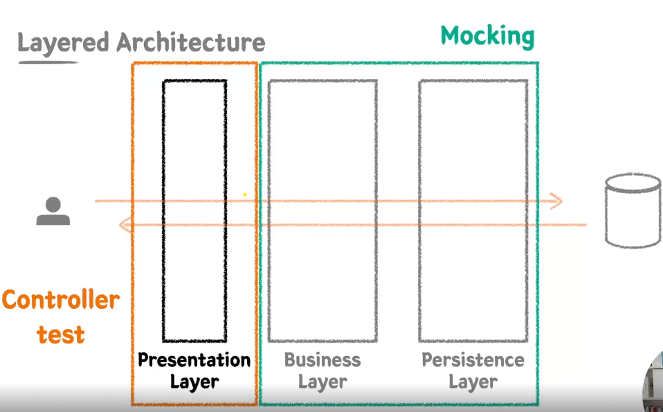

## MockMvc, @Transactional(readOnly = true)와 @Transactional을 분리하라고?, CQRS패턴이 뭐야?

### MockMvc

Mock(가짜) 객체를 사용해 스프링 MVC동작을 재현할 수 있는 test framework

### @Transactional(readOnly = true)와 @Transactional을 분리해야한다!
- 위처럼 하게되면, JPA에서 이점이 발생하게 된다.
  * JPA에서는 스냅샷을 저장해서 트랜잭션이 commit하는 시점에 변경감지를 한다.
     - readOnly = true를 하게 되면, create, update, delete작업이 동작을 하지 않아서 스냅샷 저장 및 변경감지를 하지 않아도 되는 이점이 발생한다.
     - 즉, 성능향상의 효과가 발생한다!
  * CQRS - Command(create, update, delete)와 Query(Read)에 대한 책임을 분리하자.
    - 사용자 수가 많아지게 될때, command와 query간의 서로 영향이 없어야한다.
    - Query용 Service와 Command Service를 명시적으로 관리할 수도 있다.
    - DB에 대한 endpoint도 구분함으로써 장애격리를 방지할 수 있다. 
      - Read용 DB와 Write와 DB를 구분할 수 있다.
    - 여기 프로젝트에서는, 위 두개를 구분하기 위해, **Service단의 전체는 @Transactional(readOnly = true)을 적용하고 command단의 메소드는 명시적으로 @Transactional을 적용하자.**
