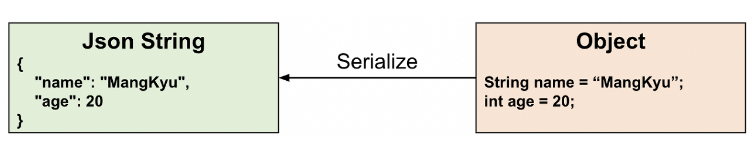
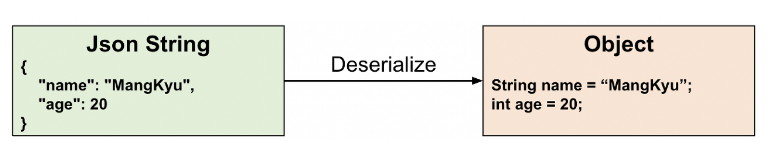

## objectMapper로 string형태의 json을 직렬화, 역직렬화한다고?

- 직렬화
  - 객체로부터 json형태의 문자열을 만들어냄
  - spring에서는 jackson모듈의 objectMapper라는 클래스가 직렬화를 처리함. -> 이 과정에서 objectMapper의 writeValueAsString이라는 메소드가 사용됨.
  - @ResponseBody나 @RestController 또는 ResponseEntity등을 사용하는 경우에 처리됨.

- 역직렬화
  - json문자열로부터 객체를 만들어냄
  - 기본생성자로 객체를 생성한 후, 필드값을 찾아서 값을 바인딩 해줌
  - 따라서, 기본생성자가 없다면, 에러를 발생시킴.
  - spring에서는 @RequestBody로 json문자열을 객체로 받아올 때 역직렬화를 처리함.

- 참조블로그
  - https://mangkyu.tistory.com/223