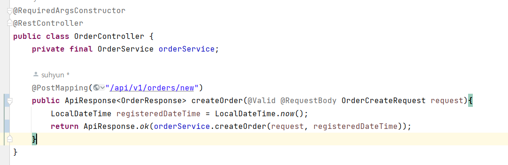

## controller와 service간의 의존관계가 생겼다! 이를 위한 해결책은?

- 위 사진에서는 controller에서 service까지 controller에서 받은 dto를 그대로 service단까지 주고 있다.
- 이렇게 되면 위 두 layer간의 의존관계가 발생하게 된다.
- 하위 layer(service)가 상위 layer(controller)를 알고 있는 것은 바람직하지 않다.
- 이를 해결해주기 위해, service를 위한 dto를 별개로 만들어준다!

- 참조 : OrderCreateRequest의 toServiceRequest()와 OrderCreateServiceRequest를 분리해준다!